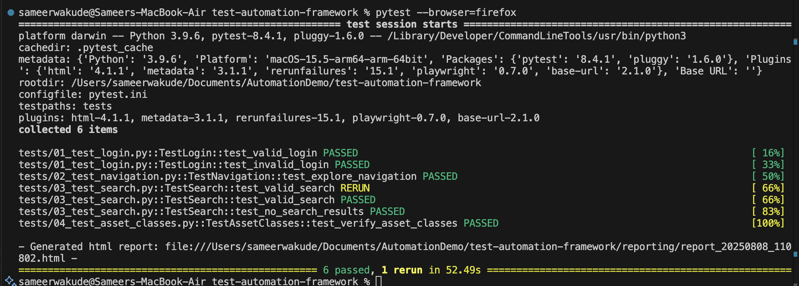
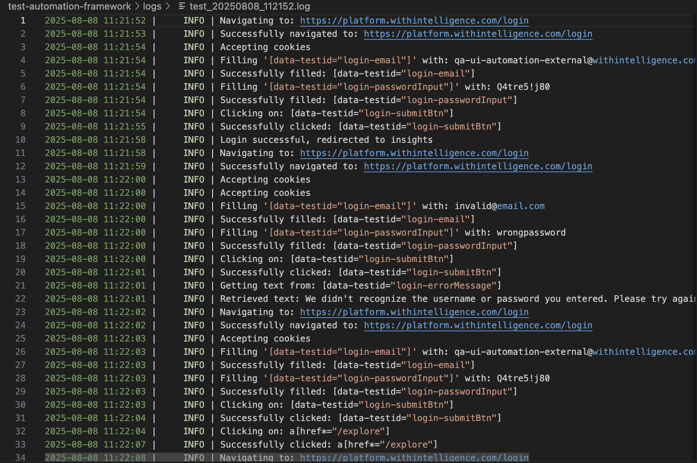
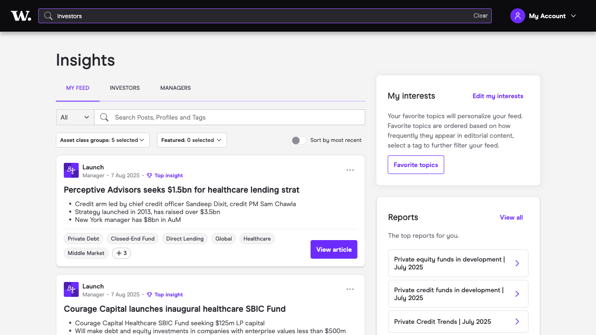

# Test Automation Framework

Test automation framework using Playwright with Python with and pytest for testing web applications.

## Features and Details of the framework
- **Page Object Model**: uses this design pattern
- **Configurable Parameter**: You can decide which browser to use, Headed/Headless, Which Test Enviornment (Dev,QA,Staging,Prod) to run tests against, etc
- **Auto Retry-ability**: Runs failed tests cases again (configurable as to how many times)
- **Logging**: Logs for each runs are generated
- **Reporting**: HTML report available for the run
- **Screenshots**: Screenshots are taken for failed tests
- **Credentials**: Credentials are pushed to git, instead stored in .env file

## Project Structure

```
test-automation-framework/
├── tests/              # Test files
├── pages/              # Page Object classes
├── utils/              # Helper utilities
├── config/             # Configuration files
├── reporting/          # HTML reports
├── logging/            # Log configuration
├── data/               # Test data files
├── screenshots/        # Failed test screenshots
├── logs/               # Test execution logs
├── requirements.txt    # Python dependencies
├── .env               # Environment variables
├── .gitignore         # Git ignore file
├── pytest.ini         # Pytest configuration
└── README.md          # This file
```

## Prerequisites

- Python 3.8 or higher
- pip (Python package manager)

## Setup Instructions
### 1. Clone the repo
```bash
git clone https://github.com/dcoolsam/WithIntelligence.git
```

### 2. Install Dependencies

```bash
pip install -r requirements.txt
```

### 3. Install Playwright Browsers

```bash
playwright install
```

### 4. Configure Environment 
**(VERY IMP: Remember the password abc123 with actual password )**

Create a `.env` file in the project root and add your test credentials:

```
TEST_USERNAME=qa-ui-automation-external@abc.com
TEST_PASSWORD=abc123 (IMPORTANT: Replace the password abc123 with the actual password)
```

### 4. Configure Test Settings

Edit `config/config.py` to customize:
- Browser type (chromium, firefox, webkit)
- Headless mode (True/False)
- Environment (dev, qa, staging, prod)
- Base URL for each environment

## Running Tests

### Run All Tests
```bash
pytest
```


### Run Specific Test File
```bash
pytest tests/01_test_login.py
```

### Run in debug mode
```bash
pytest -s
```


### Run Tests with browser
```bash
# Run with custom browser
pytest --browser=firefox

# Run tests with markers (Tests need to be marked with pytest fixture before)
pytest -m smoke
```

### Run Tests in Different Environments

Modify `config/config.py` to change the `CURRENT_ENV` variable:

```python
CURRENT_ENV = 'staging'  # Change to desired environment
```

## Test Scenarios Included

### 1. User Login Tests
- **Valid Credentials**: Tests successful login with correct credentials
- **Invalid Credentials**: Tests error handling with incorrect credentials

### 2. Navigation Tests
- **Explore Link**: Tests navigation from insights to explore page

### 3. Search Functionality Tests
- **Valid Search**: Tests search with valid search string
- **No Results Search**: Tests search with invalid search string

### 4. Asset Classes Verification
- **Profile Settings**: Verifies correct asset classes are selected

## Viewing Reports

### HTML Report
After running tests, view the HTML report:
```
reporting/report_YYYYMMDD_HHMMSS.html
```
Open this file in your web browser to see detailed test results.


### Logs
Test execution logs are saved in the `logs/` folder with timestamps:
```
logs/test_run_YYYYMMDD_HHMMSS.log
```


### Screenshots
Failed tests automatically capture screenshots saved in the `screenshots/` folder.



## Customization

### Adding New Tests
1. Create new test file in `tests/` folder
2. Follow the existing pattern using Page Object Model
3. Import required page classes
4. Use fixtures for browser setup

### Adding New Pages
1. Create new page class in `pages/` folder
2. Inherit from `BasePage` class
3. Define locators and methods
4. Include logging for actions

### Changing Browser Settings
Edit `config/config.py`:
```python
BROWSER = 'chromium'    # chromium, firefox, webkit
HEADLESS = False        # True for headless mode
```

### Environment Configuration
Add new environments in `config/config.py`:
```python
ENVIRONMENTS = {
    'dev': 'https://dev.platform.abc.com',
    'qa': 'https://qa.platform.abc.com',
    'staging': 'https://staging.platform.abc.com',
    'prod': 'https://platform.abc.com',
    'local': 'http://localhost:3000'  # Add new environment
}
```

## Troubleshooting
Check the logs or run using python -s

**1. Playwright not installed**
```bash
playwright install
```

**2. Environment variables not loading**
- Ensure `.env` file exists in project root
- Check file format and spelling
- Ensure the correct password is added to this file (not adding the real password as this file will be on GIT publicly)

**3. Tests failing due to timeouts**
- Increase timeout in `config/config.py`
- Change Retry count in `config/config.py`

**4. Browser not launching**
- Try different browser: `--browser=firefox`
- Check if running in headless mode

### Getting Help
1. Check test logs in `logs/` folder
2. Review screenshots for failed tests
3. Run the logs in real time with `pytest -s` option
4. Ensure test environment is accessible
5. Confirm the username and passwords are correct